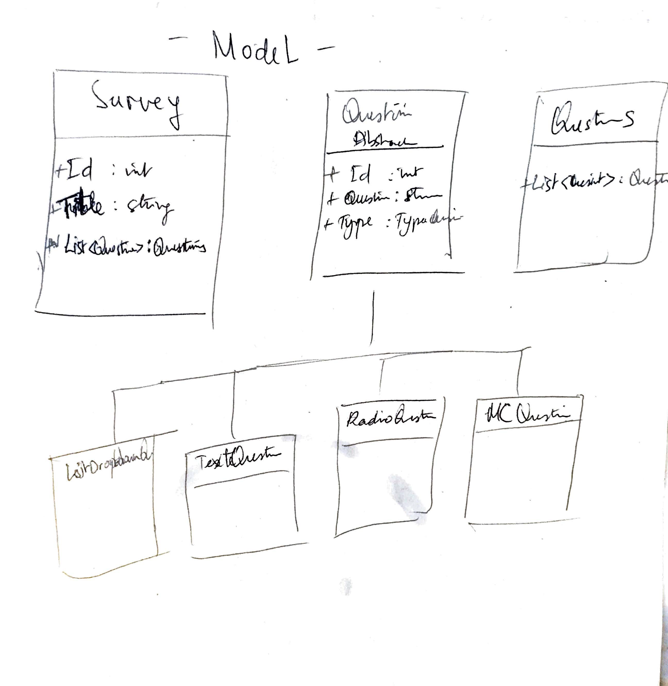

# Project : surveyCreator
=========================

#### AUTEUR: NGABONZIZA Aimé @angaboli 

Description
===========
This web application is a system to create questionnaire and managing theme including there questions, then calculate the result at the end of the questionnaire.

Chronology
==========

* Need
* Environment
* Developement
* Recipe
* Production

Platform
--------
* Apache Server
* MySQL
* php7

Planning
========
```
.
|__Need -> 30/03
    |__Environment -> 30/03
        |__Development -> 01/04
            |__Recipe -> 15/04
                |__Production 17/04
			

```

Arborescence du Projet
======================
```

├───app
│   ├───controller
│   │   └───admin
│   ├───entity
│   ├───table
│   └───views
│       ├───admin
│       │   ├───dashboard
│       │   ├───questions
│       │   ├───results
│       │   └───surveys
│       ├───questionnaires
│       ├───questions
│       ├───templates
│       └───users
├───config
├───core
│   ├───auth
│   ├───controller
│   ├───database
│   ├───entity
│   ├───html
│   └───table
└───public
    ├───css
    ├───images
    ├───js
    │   └───demo
    └───vendor
        ├───bootstrap
        │   ├───js
        │   └───scss
        │       ├───mixins
        │       ├───utilities
        │       └───vendor
        ├───chart.js
        ├───datatables
        ├───fontawesome-free
        │   ├───css
        │   ├───js
        │   ├───less
        │   ├───scss
        │   ├───sprites
        │   ├───svgs
        │   │   ├───brands
        │   │   ├───regular
        │   │   └───solid
        │   └───webfonts
        ├───jquery
        └───jquery-easing


```
UML
===
